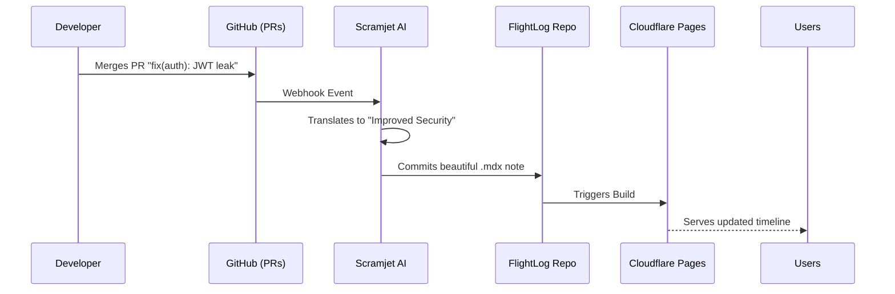

<div align="center">
  <h1>FlightLog</h1>
  <p><strong>A breathtaking, automated Changelog engine for modern SaaS.</strong></p>
  <p>Linear-style aesthetics. 100% open-source. Powered by Astro and Tailwind CSS.</p>

  <!-- The 6-Badge Array -->
  <a href="https://flightlog.scramjet.io" target="_blank"></a>
  <a href="https://deploy.workers.cloudflare.com/?url=https://github.com/scramjetio/flight-log"></a>
  <a href="https://scramjet.io" target="_blank"></a>
  <a href="https://discord.gg/scramjetio" target="_blank"></a>
  <a href="https://github.com/scramjetio/flight-log/stargazers"></a>
  <a href="https://github.com/scramjetio/flight-log/actions"></a>
</div>

---

## ⚡️ Why FlightLog?

Most changelog tools fall into two flawed categories:
1. **The Widget SaaS**: Expensive ($50+/mo), disconnected from your git workflow, and visually incongruent with your app.
2. **The "Raw Output"**: A list of GitHub commit hashes that are unreadable to your actual customers.

**FlightLog** is different. It provides the breathtaking, dark-mode timeline UI made famous by design-forward companies like Linear and Raycast, but you own the code. 

### Features
- 🎨 **Linear-style Aesthetics:** Deep dark mode, vertical timeline view, beautiful typography, and embedded media support.
- 📝 **Markdown Native:** Write your release notes in standard `.mdx`.
- ⚡️ **Astro Powered:** Blazing fast, zero-JS by default, deployable anywhere (Vercel, Cloudflare, Netlify).

## 🎥 In Action
> **[TODO]:** Insert a 5-second WebP or GIF here showing scrolling through the beautiful timeline UI.
*(Placeholder: ``)*

## 🚀 Quick Start

**Prerequisites:** Node.js >= 18.0

```bash
git clone https://github.com/scramjetio/flight-log.git my-changelog
cd my-changelog
npm install
npm run dev
```

## 🤖 The Trojan Horse: Powered by Scramjet

Writing changelogs manually is tedious. FlightLog is designed to be the "Publishing Surface" for **Scramjet**, our automated event-driven content pipeline.

If you don't want to copy-paste from Jira to Markdown, you can use Scramjet to:
1. Listen to your GitHub Pull Requests or Linear tickets.
2. Automatically translate developer jargon (`fix(auth): race condition`) into customer-friendly feature announcements.
3. Commit the formatted `.mdx` directly into this FlightLog repository.

*Learn more about automating your changelog with Scramjet [here](https://scramjet.io).*

<details>
<summary><strong>🗺️ View Architecture Diagram</strong></summary>


</details>

## 📄 License
MIT © The Scramjet Team
